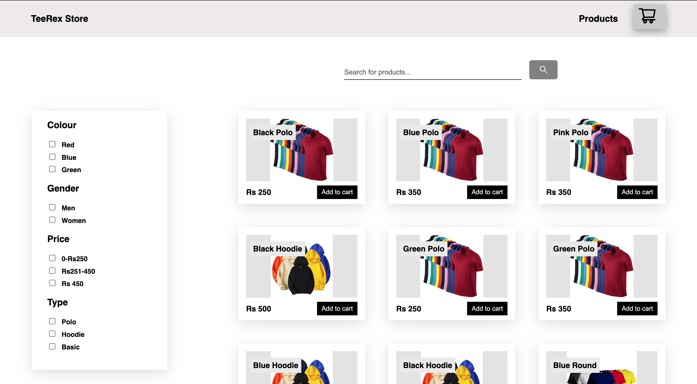
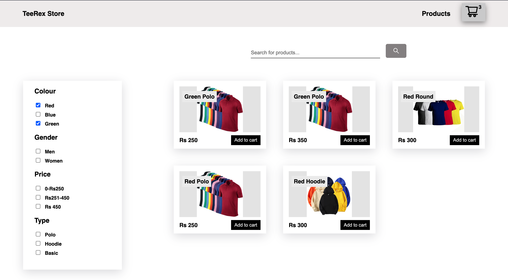
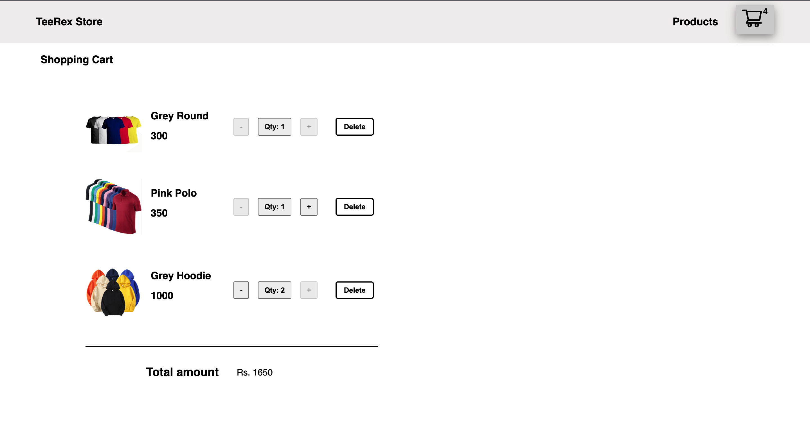

# TeeRex-Store

A simple e commerece project challenge.

## Functionalities

- Product Page with searching and filtering options
- User can add product into cart
- User can increase/decrease quantity of product and also delete it from the cart

## Screenshots

## Product Page

<!-- ## Product Page (Responsive) ;

 -->

## Cart Page

<!-- ## Cart Page (Responsive)

 -->

## Team Members

Solo project

## Tech Stacks

- React
- React Router Dom
- Redux
- Redux-Thunk
- API
- HTML
- CSS
- JavaScript

## Tools

- Vs Code
- Git

## Installation

Clone the project and run command npm start to launch the project in local machine

## Run Project :

In the project directory, you can run:

### `npm start`
